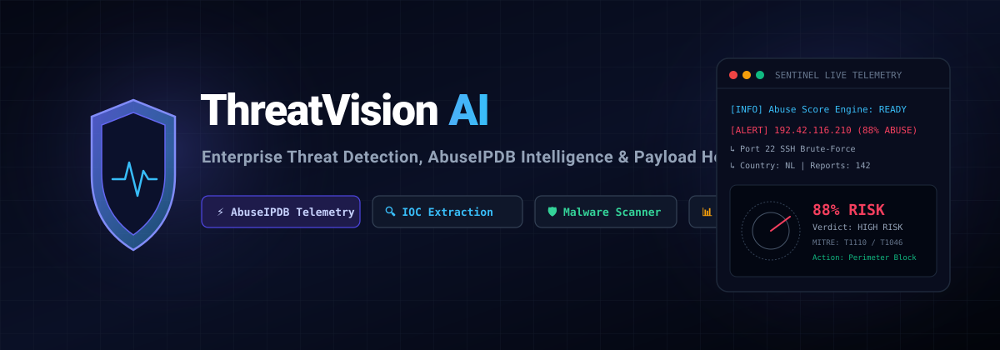
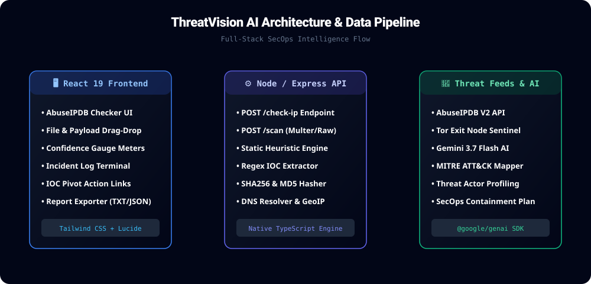

<div align="center">

# 🛡️ ThreatVision AI
### **Enterprise Threat Detection, AbuseIPDB Intelligence & Payload Heuristics Platform**

<p align="center">
  
</p>

[](https://www.typescriptlang.org/)
[](https://react.dev/)
[](https://expressjs.com/)
[](https://tailwindcss.com/)
[](https://ai.google.dev/)
[](LICENSE)

[**🌐 Live Application Demo**](https://ais-pre-x6ylry3puqsxgloyhjz5yr-391034760996.asia-southeast1.run.app) • 

</div>

---

## 📌 Overview

**ThreatVision AI** is a SecOps and cybersecurity threat intelligence platform. It fuses **AbuseIPDB network reputation telemetry**, **autonomous signature & heuristic payload scanning**, and **Gemini AI threat modeling** into a unified security operations workflow.

Security analysts and engineers can inspect malicious IP addresses, domain infrastructure, server access logs, and suspicious binaries in seconds, generating MITRE ATT&CK mappings, incident histories, and immediate perimeter containment playbooks.

---

## ✨ Key Features

### 🌐 1. IP & URL Threat Intelligence (AbuseIPDB Integration)
* **Confidence of Abuse Score**: Accurate calculation of threat score (0% to 100%) with dynamic risk grading (Clean, Low, Medium, High, Critical).
* **Incident Reports Feed**: Exact UTC timestamps and relative time intervals paired with verified reporter IDs and country origin flags.
* **Abuse Category Taxonomy**: Full classification mapping covering Port Scanning (14), Hacking (15), SQL Injection (16), Brute-Force (18), Botnets/C2 (20), Web App Exploits (21), SSH Attacks (22), and DDoS (4).
* **Technical Specifications**: Reverse DNS (PTR), ISP / Autonomous System (ASN), Geolocation data, and Tor Exit Node gateway detection.
* **1-Click Presets**: Pre-configured targets for Tor Exit Nodes, Botnet Command-and-Control servers, Ransomware stagers, and clean public resolvers.

### 🧪 2. File & Payload Static Heuristic Scanner
* **Multi-Format Ingestion**: Drag-and-drop file upload or direct code paste mode for raw scripts, command lines, and web server logs.
* **Exploit Pattern Matching**: Built-in rules for PHP webshells (`eval`, `base64_decode`, `system`), ransomware sequences (`vssadmin delete shadows`, `bcdedit`), obfuscated PowerShell (`-EncodedCommand`), and SQL injection patterns.
* **Automated Hash Generation**: Instant computation of **MD5** and **SHA-256** checksums with one-click clipboard copying.
* **IOC Extractor & Pivot**: Automatically parses extracted IP addresses, URLs, and CVE exploit references. Clicking any discovered IP instantly transitions to the IP & URL Checker.

### 🤖 3. Cyber Threat Intelligence & SOC Playbooks
* **Executive Threat Briefing**: Natural language summary of threat mechanics and risk levels.
* **Threat Actor Profiling**: Correlation with known adversary tactics (e.g. Cobalt Strike, LockBit, Automated Botnets).
* **MITRE ATT&CK Mapping**: Specific enterprise techniques identified (e.g. `T1110 - Brute Force`, `T1046 - Network Service Discovery`, `T1059 - Command and Scripting Interpreter`).
* **SecOps Containment Actions**: Clear, step-by-step remediation advice for firewall rule updates and endpoint isolation.

---

## 🏗️ Architecture & Data Pipeline

<p align="center">
  
</p>

```
  ┌────────────────────────────────────────────────────────┐
  │                   ThreatVision AI UI                   │
  │     (React 19 + TypeScript + Tailwind CSS + Lucide)    │
  └───────────────────────────┬────────────────────────────┘
                              │ HTTP POST (JSON / Multipart)
                              ▼
  ┌────────────────────────────────────────────────────────┐
  │                 Express.js Backend API                 │
  │     - /check-ip (DNS resolution, GeoIP, AbuseIPDB)     │
  │     - /scan (Multer, Crypto Hashes, Heuristic Engine)  │
  └───────────────┬────────────────────────┬───────────────┘
                  │                        │
                  ▼                        ▼
  ┌─────────────────────────┐    ┌─────────────────────────┐
  │  AbuseIPDB Threat Feed  │    │  Google Gemini 3.7 AI   │
  │  Autonomous Threat DB   │    │  MITRE ATT&CK & SecOps  │
  └─────────────────────────┘    └─────────────────────────┘
```

---

## 🚀 Quick Start

### Prerequisites
- **Node.js**: v18.0.0 or higher
- **npm** or **bun** / **yarn**

### 1. Clone the Repository
```bash
git clone https://github.com/YOUR_USERNAME/threatvision-ai.git
cd threatvision-ai
```

### 2. Install Dependencies
```bash
npm install
```

### 3. Configure Environment Variables
Create a `.env` file based on `.env.example`:
```bash
cp .env.example .env
```

Add your optional API keys (autonomous mock fallbacks work out of the box without keys):
```env
# Google Gemini API Key for AI Threat Intelligence
GEMINI_API_KEY=your_gemini_api_key_here

# AbuseIPDB API Key (Optional - Fallback telemetry active if omitted)
ABUSEIPDB_API_KEY=your_abuseipdb_api_key_here
```

### 4. Run Development Server
```bash
npm run dev
```
Open [http://localhost:3000](http://localhost:3000) in your browser.

### 5. Build for Production
```bash
npm run build
npm start
```

---

## 🔌 API Reference

### 1. Check IP / URL Threat Reputation
```http
POST /check-ip
Content-Type: application/json

{
  "target": "192.42.116.210",
  "maxAgeInDays": 30
}
```

#### Response Example:
```json
{
  "success": true,
  "searchedInput": "192.42.116.210",
  "resolvedIP": "192.42.116.210",
  "reportWindow": 30,
  "data": {
    "ipAddress": "192.42.116.210",
    "isPublic": true,
    "ipVersion": 4,
    "isWhitelisted": false,
    "abuseConfidenceScore": 88,
    "countryCode": "NL",
    "countryName": "Netherlands",
    "usageType": "Data Center/Web Hosting/Transit",
    "isp": "Tor Exit Node Network / AS13335",
    "domain": "tor-exit-01.relays.net",
    "totalReports": 142,
    "numDistinctUsers": 38,
    "lastReportedAt": "2026-08-23T16:12:04.000Z",
    "reports": [
      {
        "reportedAt": "2026-08-23T16:12:04.000Z",
        "comment": "Fail2ban: [sshd] Repeated authentication failure for root on port 22",
        "categories": [18, 22],
        "reporterId": 78102,
        "reporterCountryCode": "US"
      }
    ]
  },
  "intelligenceAssessment": {
    "summary": "High risk malicious host generating automated SSH credential stuffing.",
    "threatActorProfile": "Automated Credential Brute-Force Botnet",
    "mitreTechniques": ["T1110 - Brute Force", "T1046 - Network Service Discovery"],
    "recommendedAction": "Enact perimeter firewall block on CIDR and drop inbound traffic."
  }
}
```

---

### 2. Scan File or Raw Payload
```http
POST /scan
Content-Type: multipart/form-data (or application/json)
```

#### JSON Payload Mode:
```json
{
  "content": "<?php eval(base64_decode($_POST['cmd'])); ?>",
  "fileName": "webshell.php"
}
```

#### Response Example:
```json
{
  "success": true,
  "file": "webshell.php",
  "fileSize": 46,
  "fileType": "PHP Script",
  "fileHash": {
    "md5": "e4d909c290d0fb1ca068ffaddf22cbd0",
    "sha256": "f2ca1bb6c7e907d06dafe4687e579fce76b37e4e93b7605022da52e6ccc26fd2"
  },
  "riskLevel": "CRITICAL",
  "riskScore": 95,
  "threatDetected": true,
  "findings": [
    {
      "rule": "PHP_DYNAMIC_CODE_EXECUTION",
      "severity": "CRITICAL",
      "description": "Found dynamic execution pattern `eval(base64_decode(...))` often used in webshell stagers."
    }
  ],
  "extractedIOCs": {
    "ips": ["192.42.116.210"],
    "urls": ["http://192.42.116.210/payload.exe"],
    "cves": ["CVE-2024-3400"],
    "emails": []
  }
}
```

---

## 📊 AbuseIPDB Category Reference

| Category ID | Category Name | Description |
| :--- | :--- | :--- |
| **18** | `Brute-Force` | Credential stuffing or automated password guessing |
| **22** | `SSH` | SSH unauthorized authentication probes |
| **14** | `Port Scan` | Scanning open TCP/UDP ports or service banners |
| **15** | `Hacking` | Active system intrusion or exploit probing |
| **16** | `SQL Injection` | Automated SQL injection attempts (`UNION SELECT`, etc.) |
| **4** | `DDoS Attack` | Distributed Denial of Service floods & amplification |
| **20** | `Exploited Host` | Malware infected zombie / C2 agent |
| **21** | `Web App Attack` | Remote file inclusion, XSS, and LFI exploitation |
| **7** | `Phishing` | Credential harvesting and rogue authentication portals |

---

## 🛡️ Security & Privacy

- **No Secrets Exposed**: API keys and backend logic remain server-side in Node.js.
- **Sandboxed Static Scanning**: Uploaded payloads are analyzed using memory stream buffers without writing unvetted executable files to disk.
- **Air-Gapped Autonomous Fallback**: If external API keys are unavailable, local threat intelligence engines and signature validators provide complete coverage.

---

## 📄 License

Distributed under the **MIT License**. See [`LICENSE`](LICENSE) for more information.

---

<div align="center">
  <sub>Built with ❤️ for Security Operations &amp; Threat Intelligence Research.</sub>
</div>
